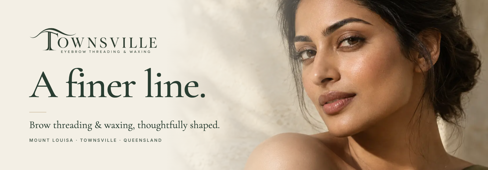
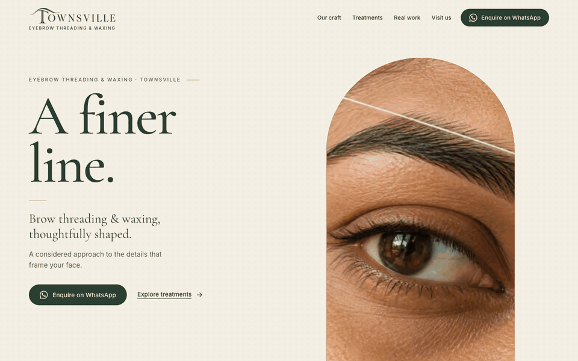
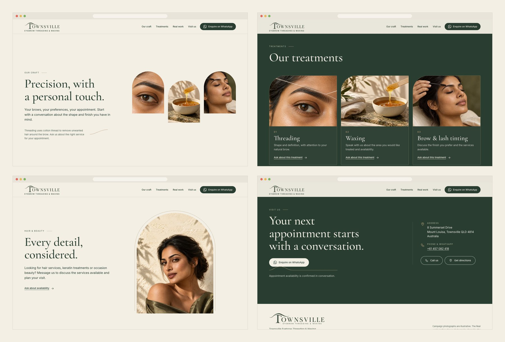
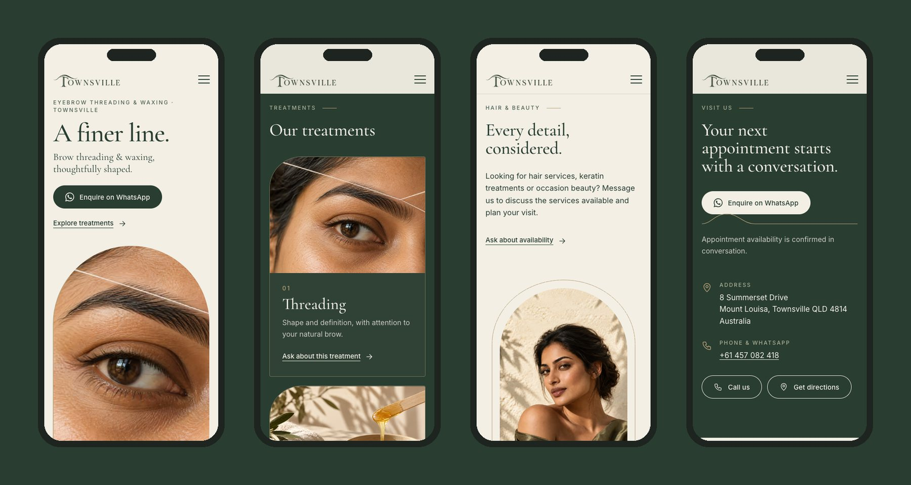

<div align="center">



<h3>A one-page website for a brow threading and waxing studio in Townsville, built around a scroll film where a single champagne line becomes an arch, a portrait and three treatment windows.</h3>

<p>
  <a href="https://townsville-eyebrow-threading.vercel.app"><strong>🌐 Live site</strong></a>
  &nbsp;·&nbsp;
  <a href="#hero-animation"><strong>🎬 How the hero works</strong></a>
  &nbsp;·&nbsp;
  <a href="#getting-started"><strong>🛠️ Run it locally</strong></a>
</p>

<p>
  <a href="https://townsville-eyebrow-threading.vercel.app"></a>
  
  
  
  
</p>

</div>

<br />

## 🚀 Overview

**Townsville Eyebrow Threading & Waxing** is a brow studio in Mount Louisa, Townsville. The creative direction is called *A finer line.*: the precision of a single cotton thread. On the site that idea is literal. A champagne line draws an arch around a close-up of a brow, the arch widens into the full portrait, a loop of the same line passes behind her, and then the arch sweeps away to open three windows that settle into the next section.

Booking works the way the business already works: **every call to action opens a WhatsApp conversation** (or a phone call). Nothing is reserved automatically, and availability is always confirmed in conversation.

- **Cinematic first impression**: a pinned hero made of real image layers (wall plate, alpha portrait, macro) and two SVG lines, not a video
- **Contact on the first screen**: name, headline and *Enquire on WhatsApp* are visible before any scroll
- **Honest content**: campaign photography is labelled as illustrative; the *Real work* section shows only the business's own photographs, unretouched
- **Light**: the first load transfers about 197 KB on a phone and 232 KB on a 1440 px desktop (HTML, CSS, JS, fonts and images, measured on the production build)

<br />

<a name="hero-animation"></a>

## 🎬 The hero animation

<div align="center">
  <a href="https://townsville-eyebrow-threading.vercel.app"></a>
  <sub>Scroll-scrubbed on the live site · captured at 1440 × 900</sub>
</div>

<br />

The hero track is 2.2 screen heights tall (the stage stays pinned for 1.2 of them) and follows the kit's scroll script, *The line that reveals*:

| Scroll  | Scene          | What happens                                                                                          |
| :------ | :------------- | :---------------------------------------------------------------------------------------------------- |
| 0–16%   | The thread     | The champagne line finishes drawing an arch around the brow macro (scale 1.10 → 1.05)                  |
| 16–42%  | The gaze       | A short crossfade from macro to portrait inside the arch, then the arch widens into a full-bleed mask |
| 40–62%  | The presence   | The wall recedes 2%, the alpha portrait settles onto it, and a gold loop draws *behind* her shoulders |
| 62–86%  | The precision  | The arch edge sweeps left, uncovering ivory, and three windows open one after another                 |
| 86–100% | The handoff    | The windows glide to their exact places in *Our craft*, then the stage releases without a jump        |

**Under the hood**

- 🧩 **Depth from one photo.** The portrait is split into a cut-out (the kit's alpha layer) and a **wall plate** with the figure inpainted out (OpenCV, `scripts/prepare-sources.py`), so the loop can pass between them and the portrait can move without doubled contours.
- 📐 **The arch opens on the face.** The arch is computed from the cover-fit of the 1672 × 941 photo, centred on the measured face position, so it frames the eyes at any desktop size.
- 🔁 **Pixel-identical handoff.** The three windows live in a fixed dock layer at the screen rectangle their slots in *Our craft* will reach; the section rises to meet them and the swap happens on the same pixels. Nav links and `#craft` URLs land exactly at that point.
- 📱 **Compact on phones.** Below 1024 px the film is 1.5 screen heights: macro to portrait inside an arch, with no body parallax. With `prefers-reduced-motion`, on short screens or without JavaScript, the hero is a finished still and every section is visible.
- 🧪 **Capture flags.** `?nosmooth` turns off the easing toward the scroll position and `?p=0.5` freezes the timeline, for tests and screenshots.

<br />

## 🖥️ Sections

<div align="center">
  
</div>

<br />

| #   | Section                                                | Anchor        | Role                                                                                       |
| :-- | :----------------------------------------------------- | :------------ | :----------------------------------------------------------------------------------------- |
| 01  | **A finer line.**                                      | `#top`        | First impression, WhatsApp call to action, the scroll film                                 |
| 02  | **Precision, with a personal touch.**                  | `#craft`      | The approach; receives the three windows from the hero; a line links the note to the photos |
| 03  | **Our treatments**                                     | `#treatments` | Threading, waxing, brow & lash tinting; each card opens WhatsApp with a prefilled question |
| 04  | **Every detail, considered.**                          | `#beauty`     | Hair, keratin and occasion beauty as an availability enquiry (no bookable menu)            |
| 05  | **A closer look at our work.**                         | `#work`       | The business's own photographs: threading, tinting, henna and hair work                    |
| 06  | **Your next appointment starts with a conversation.**  | `#visit`      | Address, phone, WhatsApp, directions; the arch ends as a line under the button             |
| 07  | Footer                                                 | n/a           | Logo, contacts and a note on which photographs are illustrative                            |

<br />

## 📱 Mobile first, motion optional

<div align="center">
  
</div>

<br />

- Text and the WhatsApp button come first; the arch sits below and plays macro → portrait as you scroll
- The wall plate and the alpha portrait are never downloaded on phones (media-qualified `<source>` elements)
- Buttons, menu and navigation links are at least 44 px tall; no horizontal scroll at 360, 390 or 768 px
- Nothing depends on hover

<br />

## ✨ Highlights

- **🎞️ Scroll storytelling without a library**: a small progress engine (`src/js/hero.js`, about 270 lines) mapped one to one to the kit's timeline in `src/data/timeline.js`
- **💬 WhatsApp-first booking**: each treatment card opens a conversation with its own prefilled question; nothing is sent automatically
- **🧾 Facts in the HTML**: name, phone, address and links are written into the page at build time from `src/data/site.js`, so contacts work without JavaScript
- **🖼️ Responsive images**: `<x-pic>` tags in `index.html` become `<picture>` elements with AVIF and WebP sources at build time
- **♿ Accessible by construction**: skip link, visible focus on every control, labelled menu toggle, hidden states owned by the script that reveals them, reduced-motion support
- **🔎 Ready to share**: Open Graph image, `BeautySalon` structured data, canonical URL, favicon from the arched T of the real logo

<br />

## 💻 Tech stack

| <br />Vite 6 | <br />JavaScript | <br />HTML5 | <br />CSS3 | <br />sharp | <br />OpenCV | <br />Vercel |
| :---: | :---: | :---: | :---: | :---: | :---: | :---: |

### Why this stack?

- **Vite + plain JavaScript**: the page is static HTML with three small modules (hero, nav, reveal); the whole bundle is 8.9 KB of JS and 18.9 KB of CSS before compression
- **A custom scroll engine**: the film only needs normalised progress, clip-path, transforms and opacity, so no animation library is shipped
- **sharp + OpenCV**: OpenCV prepares the masters once (clean logo alpha, inpainted wall plate, crops of the real photos); sharp exports every size in AVIF and WebP
- **Self-hosted Cormorant Garamond and Inter** through Fontsource: no third-party font requests
- **Vercel**: every push to `main` deploys automatically

<br />

## 🎨 Design system

| Token       | Value                                                                        | Use                                              |
| :---------- | :--------------------------------------------------------------------------- | :----------------------------------------------- |
| Ivory       |  | Ground of the hero and the open sections         |
| Olive       |  | Type on ivory, Treatments and Visit us blocks    |
| Sage        |  | Labels on olive                                  |
| Champagne   |  | Lines, arches and numerals only (decorative)     |
| Ink         |  | Body text, hover state of the olive button       |

- **Type**: Cormorant Garamond for headings (hero 110–150 px on desktop, 58–76 px on mobile), Inter for body text at 16–19 px with 1.6 line height
- **Grid**: 12 columns, 1,440 px maximum width, 24 px gutters and 5vw margins on desktop; 20 px margins on mobile
- **Contrast**: olive on ivory 10.1:1, muted text 5.7:1, muted ivory on olive 7.1:1; champagne never carries text on ivory
- **Motion**: reveals of 18 px over 700 ms, treatment images open with vertical masks 70 ms apart, lines draw in 500–900 ms

<br />

<a name="getting-started"></a>

## 🛠️ Getting started

```bash
# Clone the repository
git clone https://github.com/Jeanfr1/TownsvilleEyebrowwebsite.git
cd TownsvilleEyebrowwebsite

# Install dependencies (Node 20+)
npm install

# Start the dev server  →  http://localhost:5173
npm run dev

# Production build  →  dist/
npm run build

# Preview the production build
npm run preview

# Regenerate the AVIF / WebP images, favicon and Open Graph image
npm run images

# Re-derive the masters from the kit (clean logos, wall plate, real-work crops)
python3 -m venv .venv && .venv/bin/pip install opencv-python-headless numpy pillow scipy
.venv/bin/python scripts/prepare-sources.py
```

<br />

## 📁 Project structure

```
TownsvilleEyebrowwebsite/
├── index.html                    # Every section: hero → craft → treatments → beauty → work → visit → footer
├── vite.config.js                # Build-time plugin: <x-pic> → <picture>, {{tokens}} from site.js
├── src/
│   ├── css/main.css              # Tokens, grid, components, hero modes, reveal states
│   ├── data/
│   │   ├── site.js               # Business facts: name, phone, WhatsApp, address, directions
│   │   ├── timeline.js           # The scroll script (desktop film and compact mobile version)
│   │   └── asset-meta.json       # Image sizes written by npm run images
│   └── js/
│       ├── main.js               # Entry: fonts, styles, module init
│       ├── hero.js               # Modes, arch geometry, layers, dock handoff into #craft
│       ├── nav.js                # Header state and mobile menu
│       └── reveal.js             # Section reveals, masks and line drawing
├── public/                       # img/ (generated), favicon, touch icon, og.jpg
├── scripts/
│   ├── prepare-sources.py        # OpenCV: logo cleanup, wall plate inpainting, real-work crops
│   └── build-images.mjs          # sharp: responsive AVIF / WebP, favicon, Open Graph image
├── assets-src/                   # Masters derived from the kit
└── townsville-a-finer-line/      # The creative kit (brief, scripts, mockups, layers); not deployed
```

<br />

## 🚀 Deployment

Hosted on **Vercel** and connected to this repository: every push to `main` ships to production.

**Live site:** [townsville-eyebrow-threading.vercel.app](https://townsville-eyebrow-threading.vercel.app)

| Setting          | Value           |
| :--------------- | :-------------- |
| Framework        | Vite            |
| Build command    | `npm run build` |
| Output directory | `dist`          |

The kit, the image masters and the scripts are excluded from the upload by `.vercelignore`. The page carries `noindex` until the business approves it.

<br />

## 📌 Content checklist

Items waiting on the business. Each one is marked `TODO(townsville)` in `index.html` or `src/data/site.js`.

- [ ] Reconfirm opening hours (the listing showed 9am–6pm daily; they are not published on the site)
- [ ] Confirm the current service menu, including hair, keratin, occasion beauty and henna (shown as enquiries only)
- [ ] Confirm permission to publish the photographs in **Real work**
- [ ] Google Maps place link for **Get directions** (it currently searches the street address)
- [ ] Final domain, then update `canonical` / `og:url` in `site.js` and remove `noindex` from `index.html`
- [ ] Prices and durations, if the business wants them listed (none were supplied)

Choices made where the brief contradicted itself:

- The copy file (`03-secoes-copy-en.md`) is used over the mockup text, so the mockup's taglines (for example "Lasting confidence", "Skilled hands, natural results") are not on the site
- *Tinting* is named **Brow & lash tinting**, as in the copy file
- The scroll script hands the three windows "to the next section": they dock into **Our craft**, the section right after the hero, and the treatment cards follow in normal flow
- The header shows the wordmark with the descriptor as text, because the descriptor inside the full logo is unreadable at header size (the kit asks for a readable descriptor)
- No review counts or ratings: the sources disagree and the kit sets the review claim to none

<br />

## 🙏 Acknowledgments

- **Townsville Eyebrow Threading & Waxing** for the photographs in *Real work* and the business details
- **[Cormorant Garamond](https://fonts.google.com/specimen/Cormorant+Garamond)** by Christian Thalmann and **[Inter](https://rsms.me/inter/)** by Rasmus Andersson (OFL), via **[Fontsource](https://fontsource.org)**
- **[sharp](https://sharp.pixelplumbing.com)** and **[OpenCV](https://github.com/opencv/opencv)** for the image pipeline
- **[Vite](https://vite.dev)** and **[Vercel](https://vercel.com)**

<br />

---

<div align="center">
  
  <p><strong>A finer line.</strong></p>
  <p>Built with ❤️ by <a href="https://github.com/Jeanfr1">Jean</a> for Townsville Eyebrow Threading &amp; Waxing</p>
  <sub>© 2026 Townsville Eyebrow Threading &amp; Waxing. All rights reserved.</sub>
</div>
